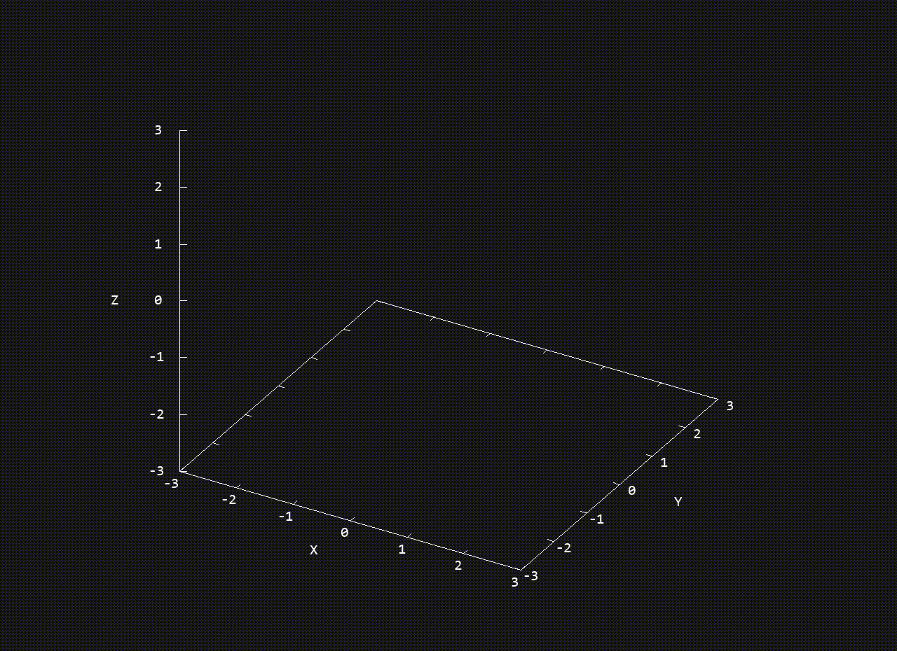

## Operationen mit Vektoren

### Beispiel



---

### Vorraussetzungen

Das Programm verwendet Gnuplot (v.5.2) zum Darstellen der Vektoren, entwickelt wurde es in Cygwin. Gnuplot gibt die Plots dabei in das Terminal aus, es wird dazu Sixel genutzt (was manche Terminals eventuell nicht unterstützen).

---

### Kompilieren und Ausführen

```bash
gcc main.c -o x
./x
```

---

### Weiteres

Das Programm ist noch nicht fertig entwickelt - es enthält daher sicherlich noch hier oder dort den einen oder anderen Fehler.